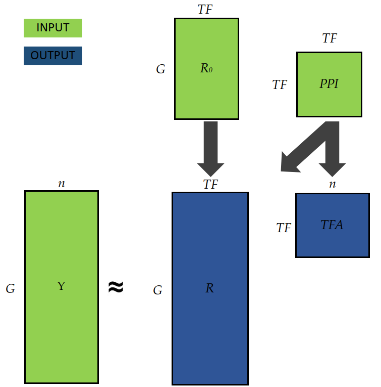

# GIRAFFE: biologically informed inference of gene regulatory networks

A scalable matrix factorization-based algorithm to jointly infer regulatory effects and transcription factor activities developed in the context of my [Master's Thesis](/thesis.pdf). 

Consider a setting with G genes, TF proteins (transcription factors), and n samples (e.g. individual in a studies or cells). Given a gene expression matrix (matrix of dimension G x n), a prior for the regulatory network (matrix of dimension G x TF), and a protein-protein interaction network (matrix of dimension TF x TF), GIRAFFE computes:

- A matrix for the transcription factor activities TFA. Each entry describes the amount of proteins available to regulate their target genes.
- A regulatory network R of dimension G x TF. Weights can be interpreted as coefficients of a linear model that considers the transcription factor activity as covariates, and gene expression as target. 



## Install

Clone the repository into your local disk:

```bash
git clone https://github.com/soelmicheletti/giraffe.git
```

Then install giraffe through pip:

```bash
cd giraffe
pip install -e .
```
Upon completion you can load netZooPy in your python code through

```python
import giraffe
```

## Usage

```python
import giraffe
import numpy as np

# Generate toy data
G = 100 # Genes
TF = 20 # Transcription factors (proteins)
n = 10 # Samples (e.g. individuals)

# expression of size (G, n); prior of size (G, TF); PPI of size (TF, TF)
expression = np.random.random((G, n))
prior = np.random.randint(0, 2, size = (G, TF))
ppi = np.random.randint(0, 2, size = (TF, TF))
ppi ^= ppi.T
np.fill_diagonal(ppi, 1)

# Run GIRAFFE
giraffe_model = giraffe.Giraffe(expression, prior, ppi)

R_hat = giraffe_model.get_regulation() # Size (G, TF)
TFA_hat = giraffe_model.get_tfa() # Size (TF, n)
```

More details can be found in our [Tutorial](./Turotial.ipynb). 

## Structure of the repo

- ```giraffe``` contains the source code of our algorithm.
- ```notebooks/data``` contains the data used and generated in the experiments. Note that the version on GitHub does **not** contain all the data. Please download them from [Zenodo](https://zenodo.org/record/7852640#.ZEKfV5FBxkg). 
- The jupyter notebooks in ```notebooks``` can be used to reproduce the experiments in the thesis. 

## Appreciation
- [Alexander Marx](https://www.a-marx.com/), [Julia Vogt](https://mds.inf.ethz.ch/team/detail/julia-vogt/), and [John Quackenbush](https://www.hsph.harvard.edu/john-quackenbush/) for making this exchange possible. 
- [Alexander Marx](https://www.a-marx.com/), [Jonas Fischer](https://scholar.google.com/citations?hl=en&user=Gfc2NA4AAAAJ), and [Panagiotis Mandros](https://www.hsph.harvard.edu/profile/panagiotis-mandros/) for their supervision and invaluable guidance throughout this project. 
- Marouen Ben Guebila, Rebekka Burkholz, Chen Chen, Dawn DeMeo, Viola Fanfani, Intekhab Hossain, Camila Lopes-Ramos, John Quackenbush, Enakshi Saha, Katherine Shutta, and Julia Vogt for thoughtful critiques and discussions.